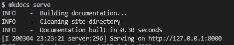
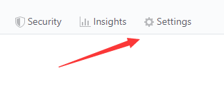
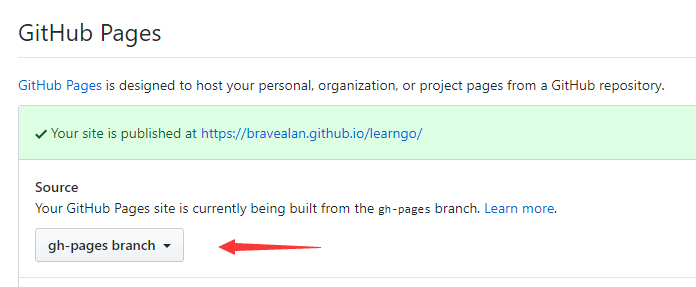
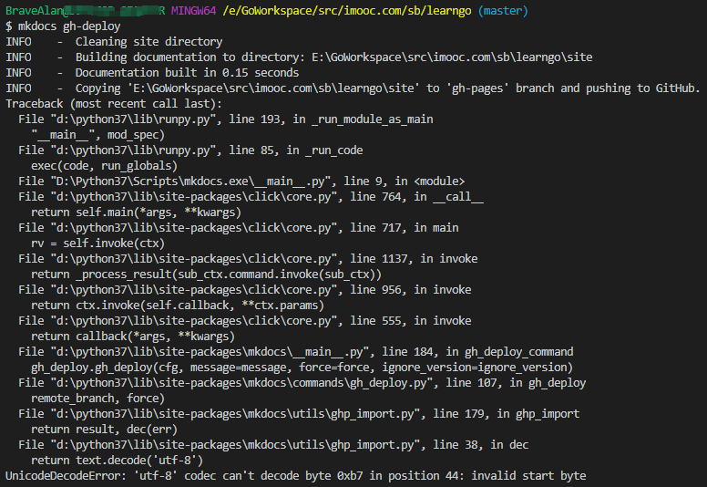

# mkdocs使用说明

记录一下主要的操作流程

mkdocs常用于文档写作，官方文档（英文）[传送门](https://mkdocs.readthedocs.io/en/stable/)

## 1. 安装依赖
```sh
pip install mkdocs
```
常用命令如下：

* `mkdocs new [dir-name]` - 创建一个新项目
* `mkdocs serve` - 启动热加载服务器，监测文档变更并在浏览器上实时预览
* `mkdocs build` - 在当前目录下生成site文件夹，将编写的文档转变成HTML文件
* `mkdocs gh-pages --clean` - 将site文件夹里的内容push到gh-pages分支，清理在原site文件夹中多余文件
* `mkdocs -h` - 命令帮助

## 2. 创建项目

使用`mkdocs new [dir-name]`创建**dir-name**文件夹，其结构如下所示：

    mkdocs.yml    # 配置文件
    docs/
        index.md  # 主页
        ...       # 其他页面

通常是为一个已经存在的git项目编写文档。因此一般的做法是将**dir-name**文件夹放置在项目的根目录下

## 3. 启动mkdocs的内置dev-server

MkDocs带有内置的开发服务器，可用于实时预览文档。在与mkdocs.yml配置文件位于同一目录下，运行`mkdocs serve`可启动Server，效果如下：


## 4. mkdocs.yml常用配置
```yml
site_name: learngo # 网站名
theme: readthedocs # 网站风格，内置mcdocs和readthedocs两种主题
nav:
  - 简介: index.md
```

### 第三方主题：

#### 1. mkdocs-material
theme: [mkdocs-material](https://github.com/squidfunk/mkdocs-material)
```sh
pip3 install mkdocs-material -i http://mirrors.aliyun.com/pypi/simple/ --trusted-host mirrors.aliyun.com
```
在mkdocs.yml里配置：
```yml
theme:
  name: 'material'
```

#### 2. mkdocs-bootswatch系列主题
theme: [mkdocs-bootswatch](https://github.com/mkdocs/mkdocs-bootswatch)

```sh
pip3 install mkdocs-bootswatch -i http://mirrors.aliyun.com/pypi/simple/ --trusted-host mirrors.aliyun.com
```

#### 3. sphinx_rtd_theme（无法使用）

```sh
pip3 install sphinx sphinx-autobuild sphinx_rtd_theme -i http://mirrors.aliyun.com/pypi/simple/ --trusted-host mirrors.aliyun.com
```


## 5. 网站发布
用github托管网站。在项目根目录下执行`mkdocs gh-pages --clean`，将site文件夹下的内容推送至gh-pages分支，并删除多余文件。如果不存在gh-pages分支，程序会自动创建。
在github上进行如下配置：

**Step1:** 点击Setting



**Step2:** 在Github Page里设置Source



## mkdocs bug
1. 在windows平台下的vscode的命令行中执行`mkdocs gh-pages`会报如下错误，但是文件确实是上传了，该错误可以忽略
   

